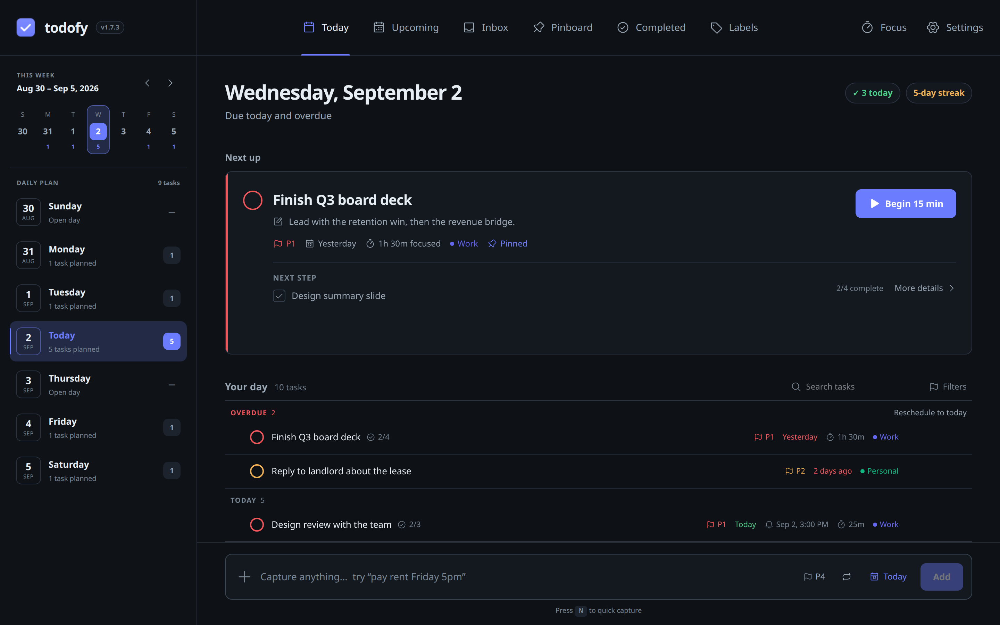
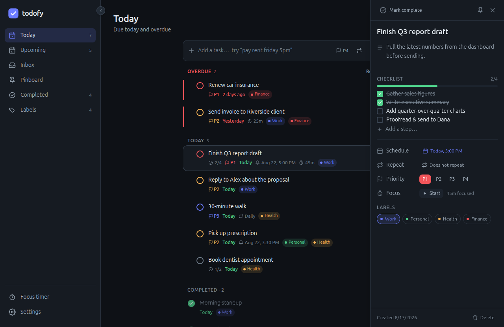
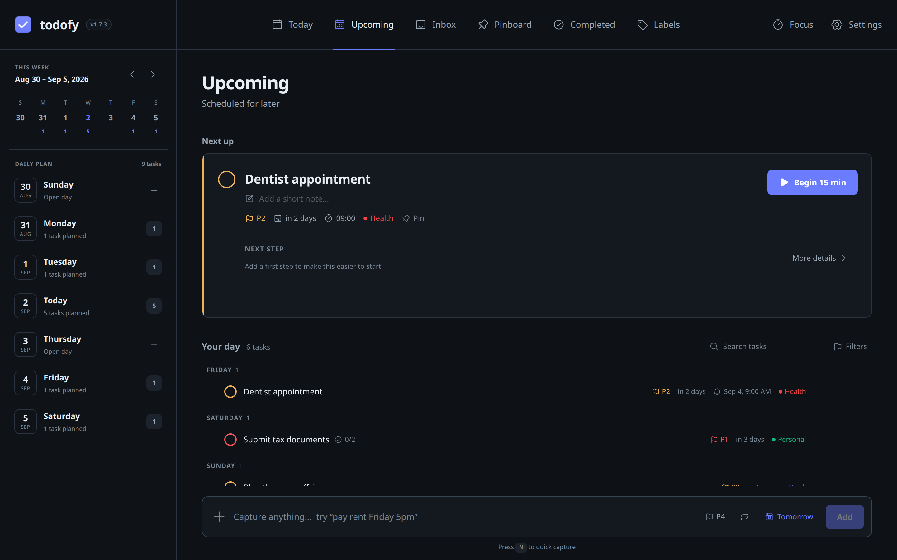
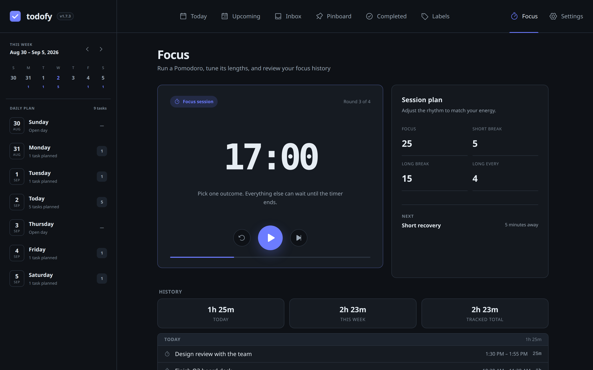
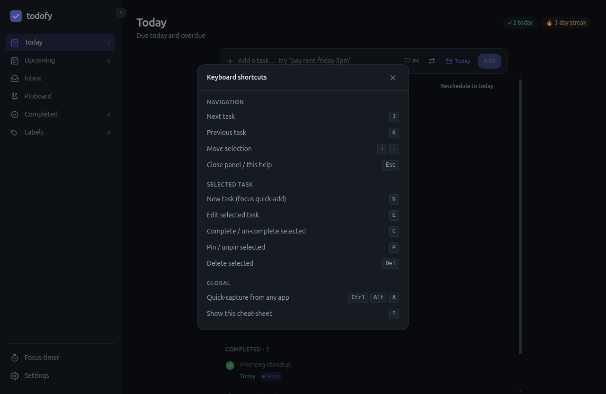
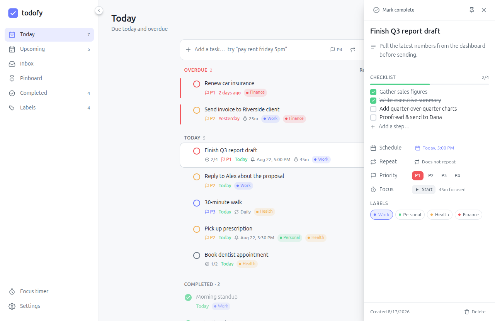

<div align="center">


# todofy

**A modern, fast, and beautiful to‑do app for Linux.**

Smart lists, labels, recurring tasks, focus timers, and reminders that actually notify you — even when it's tucked away in your tray.


<br />



</div>

---

## ✨ Features

- 🗓️ **Smart views** — _Today_ (with overdue rollup), _Upcoming_ (grouped by date), and _Inbox_
- ⚡ **Global quick‑add** — hit **Ctrl+Alt+A** anywhere (even with todofy tucked in the tray) for a floating capture bar; type, press Enter, and you're back to what you were doing
- ✍️ **Natural‑language quick‑add** — type _"pay rent friday 5pm #home p1"_ and the date, time, priority, and label are parsed out live and shown as chips
- 🔁 **Recurring tasks** — repeat _daily, every weekday, weekly, monthly,_ or _yearly_; completing one rolls it forward to the next occurrence instead of finishing it (also from natural language — _"water plants every week"_)
- 🍅 **Focus timers** — a built‑in **Pomodoro** (focus / short & long breaks) _and_ a **per‑task stopwatch**; both keep counting while hidden in the tray and survive a restart, and never auto‑stop — they nudge you instead
- 📊 **Focus screen** — start the Pomodoro, tune phase lengths, and review your focus history (Today / This week / total, grouped by day)
- ✋ **Drag‑and‑drop reordering** — grab any task and drop it exactly where you want; your manual order sticks
- 📌 **Pinning** — pin any task to float it to the top of its group, with a dedicated _Pinboard_ view
- ✅ **Completed view** — every finished task, app-wide, newest first
- ☑️ **Subtasks / checklists** — break a big task into steps with a live progress bar, so it's easier to start and keep momentum
- 🔍 **Search & filters** — narrow any view by title/notes as you type, with filter chips for priority and labels; press `/` to jump to search
- 🧠 **ADHD-friendly touches** — relative due dates (_"in 3 days"_), a completion streak & confetti reward (both optional and motion-safe), and a `?` shortcut cheat-sheet
- 🏷️ **Labels** — create, rename, recolor (with a full custom color picker), and delete; a searchable Labels page plus per-label filtering
- 📆 **Beautiful date & time picker** — click the month or year to jump anywhere in seconds
- ⏰ **Reminders that reach you** — desktop notifications fire **even when hidden in the tray**, as either a system notification or todofy's own popup card pinned to a screen corner, with one‑tap **snooze**
- 🚩 **Priorities** — P1–P4 with color‑coded flags
- ⚙️ **Settings & run‑on‑startup** — launch todofy at login, opening the window or starting quietly in the tray
- 🌗 **Light & dark themes** — dark by default, remembers your choice
- ⌨️ **Keyboard‑first** — add, navigate, complete, and edit without touching the mouse
- 🪟 **System tray** — closes to tray and keeps running so reminders never miss; start/pause the Pomodoro, stop the task timer, and watch the live countdown right from the tray
- 🧭 **Collapsible sidebar** — go full or minimal
- ☁️ **Optional account sync** — sign in with an email and password to sync your tasks, labels, and focus history across devices (backed by Supabase, with row‑level security). Sessions are kept in your OS secret store, and the whole thing is opt‑in
- 💾 **Local‑first** — everything is stored in a local SQLite database and works fully offline; sync is additive, and with no account there's no cloud and no tracking

## 📸 Screenshots

<table>
  <tr>
    <td width="50%">
      <br />
      <sub><b>Task detail</b> — break a task into a checklist with live progress.</sub>
    </td>
    <td width="50%">
      <br />
      <sub><b>Upcoming</b> — due dates phrased relatively ("in 3 days").</sub>
    </td>
  </tr>
  <tr>
    <td width="50%">
      <br />
      <sub><b>Focus</b> — a built-in Pomodoro with tunable phases and history.</sub>
    </td>
    <td width="50%">
      <br />
      <sub><b>Keyboard-first</b> — press <code>?</code> for the full cheat-sheet.</sub>
    </td>
  </tr>
  <tr>
    <td width="50%">
      <br />
      <sub><b>Light theme</b> — dark by default, light when you want it.</sub>
    </td>
    <td width="50%"></td>
  </tr>
</table>

## 📦 Install

Grab a package from the [Releases](../../releases) page, or build it yourself (see below).

**AppImage** — portable, runs on any distro:

```bash
chmod +x todofy_1.7.1_amd64.AppImage
./todofy_1.7.1_amd64.AppImage
```

**Debian / Ubuntu:**

```bash
sudo dpkg -i todofy_1.7.1_amd64.deb
```

**Fedora / RHEL / openSUSE:**

```bash
sudo rpm -i todofy-1.7.1-1.x86_64.rpm
```

**macOS** — open the `.dmg` and drag todofy into Applications. It's not
notarized yet, so on first launch right‑click the app and choose **Open** to
get past Gatekeeper:

```
todofy_1.7.1_x64.dmg      # Intel
todofy_1.7.1_aarch64.dmg  # Apple Silicon
```

**Windows** — run the installer:

```
todofy_1.7.1_x64-setup.exe   # NSIS installer
todofy_1.7.1_x64_en-US.msi   # or the MSI
```

> Your tasks live in the app's data directory — `~/.local/share/com.unifybrowse.todofy/`
> on Linux, `~/Library/Application Support/com.unifybrowse.todofy/` on macOS, and
> `%APPDATA%\com.unifybrowse.todofy\` on Windows.

## ⌨️ Keyboard shortcuts

| Key                    | Action                                                       |
| ---------------------- | ------------------------------------------------------------ |
| `Ctrl`+`Alt`+`A`       | Open the global quick‑add bar from anywhere (works app‑wide) |
| `n`                    | Focus the quick‑add bar                                      |
| `/`                    | Focus the search bar                                         |
| `j` / `↓`              | Move to next task                                            |
| `k` / `↑`              | Move to previous task                                        |
| `e`                    | Edit the selected task                                       |
| `c` / `Enter`          | Complete / uncomplete the selected task                      |
| `p`                    | Pin / unpin the selected task                                |
| `Backspace` / `Delete` | Delete the selected task                                     |
| `?`                    | Show the keyboard shortcuts cheat-sheet                      |
| `Esc`                  | Close the detail panel / picker / cheat-sheet                |

## 🛠️ Build from source

### Prerequisites

- [Rust](https://rustup.rs/) (stable)
- [Bun](https://bun.sh/)
- System libraries for Tauri on Linux:

```bash
# Debian / Ubuntu
sudo apt update
sudo apt install libwebkit2gtk-4.1-dev build-essential curl wget file \
  libxdo-dev libssl-dev libayatana-appindicator3-dev librsvg2-dev
```

### Develop

```bash
bun install
bun run tauri dev
```

### Build release bundles

```bash
bun run tauri build
```

Bundles are written to `src-tauri/target/release/bundle/` (`.deb`, `.rpm`, and `.AppImage`).

### Optional: self‑host account sync

Sync is **off by default** — todofy is local‑first and works fully offline without it. To run your own sync backend so your tasks, labels, and focus history follow you across devices (with nothing going through anyone else's server):

1. **Create a Supabase project** — the free tier is plenty — at [supabase.com](https://supabase.com), or use any Postgres you control. Make sure **Email** auth is enabled (it is by default).
2. **Apply the schema.** Open the project's **SQL Editor** and run [`supabase/migrations/20260826120000_sync_schema.sql`](supabase/migrations/20260826120000_sync_schema.sql), or use the [Supabase CLI](https://supabase.com/docs/guides/cli):

   ```bash
   supabase link --project-ref <your-project-ref>
   supabase db push
   ```

   This creates the four per‑user tables (`tasks`, `labels`, `task_labels`, `time_sessions`) with row‑level security, so a signed‑in user can only ever read or write their own rows.
3. **Point todofy at your project.** Copy the env template and fill in your project's URL and publishable key — both are safe to ship in a client; row‑level security is what actually protects the data:

   ```bash
   cp .env.example .env
   # VITE_SUPABASE_URL=https://<your-project-ref>.supabase.co
   # VITE_SUPABASE_PUBLISHABLE_KEY=<your-publishable-key>
   ```
4. **Build** as above, then open **Settings → Account** in the app and sign up — sync turns on from there.

### Regenerate the app icon

```bash
bunx tauri icon app-icon.svg
```

## 🧱 Tech stack

| Layer   | Choice                                                                |
| ------- | --------------------------------------------------------------------- |
| Shell   | [Tauri 2](https://tauri.app) (Rust)                                   |
| UI      | [Preact](https://preactjs.com) + TypeScript                           |
| Styling | [Tailwind CSS 4](https://tailwindcss.com) with a custom design system |
| State   | [Zustand](https://github.com/pmndrs/zustand)                          |
| Storage | SQLite via [rusqlite](https://github.com/rusqlite/rusqlite)           |
| Sync    | [Supabase](https://supabase.com) (Postgres + Auth), optional          |
| Build   | [Vite](https://vite.dev) + [Bun](https://bun.sh)                      |

## 📁 Project structure

```
todofy/
├── src/                    # Preact frontend
│   ├── components/         # UI (Sidebar, TaskList, TaskDetail, DatePicker,
│   │                       #     FocusView, FocusWidget, SettingsView, …)
│   ├── lib/                # dates, duration, theme, keyboard, nlp, repeat helpers
│   ├── store.ts            # Zustand store
│   └── types.ts
├── src-tauri/              # Rust backend
│   └── src/
│       ├── commands.rs     # task & label CRUD (Tauri commands)
│       ├── db.rs           # SQLite schema & migrations
│       ├── recur.rs        # recurring-task date math
│       ├── timer.rs        # focus timers (Pomodoro + per-task stopwatch)
│       ├── settings.rs     # app settings & run-on-startup
│       ├── scheduler.rs    # background reminders + timer nudges
│       ├── notify.rs       # notification delivery (portal / native)
│       ├── popup.rs        # custom corner notification window
│       ├── tray.rs         # system tray + live timer controls
│       ├── sync.rs         # account-sync merge (push/pull, last-write-wins)
│       ├── secret.rs       # OS keychain access for the session
│       └── lib.rs          # app setup
└── app-icon.svg            # source for the app icon
```

## 🗺️ Roadmap

- [x] Drag‑and‑drop reordering
- [x] Natural‑language quick‑add (_"pay rent friday 5pm"_)
- [x] Recurring tasks
- [x] Focus timers (Pomodoro + per‑task time tracking)
- [x] Run on startup
- [x] Subtasks & checklists
- [x] Search & filters
- [x] Optional account sync across devices

## 🤝 Contributing

Contributions are welcome — open an issue to report a bug or share an idea, or
send a pull request. todofy is owned and maintained by Salar Zeidanlou; by
contributing you agree that your changes are licensed to the project as
described in the [LICENSE](LICENSE).

## 📄 License

© 2026 Salar Zeidanlou. All rights reserved.

Source-available: you may view the code and contribute to it, but it may not be
used, copied, or redistributed on its own without prior written permission. See
the [LICENSE](LICENSE) for the full terms.

---

<div align="center">
Made with ❤️ and Rust, for Linux.
</div>
